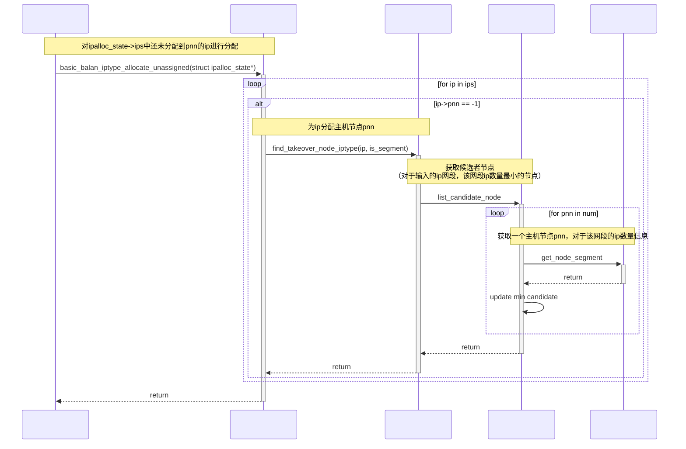
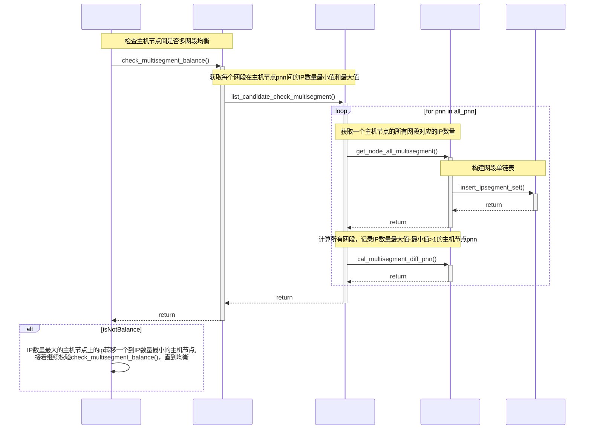

### 1. 负载均衡策略

#### 1.1 关键结构体

- 在原有的`candidate_node`结构体上添加`ipsegment_list`单链表指针
- `ipsegment_list`里面主要记录当前的网段、地址数量

```c
struct candidate_node{
	int pnn;
    int ip_num;
    int ipv4_num;
    int ipv6_num;
    // new add
    struct ipsegment_list *ipsegments;
};

// new add
struct ipsegment_list{
    struct ipsegment_list *next;
    int ip_num;
    ctdb_sock_addr netmask;
    uint8_t netmask_bits;
};
```

#### 1.2 接口实现

- 对于输入的`ip`，基于网段作负载均衡，来分配主机节点`pnn`.

```c
/*
* 增加入参is_segment，true表示分配ip按照网段均衡策略, 默认false兼容原有接口
*/
bool find_takeover_node_iptype(struct ipalloc_state *ipalloc_state, struct public_ip_list *ip, bool is_segment = false );


/*
* [in]: ipalloc_state 节点信息 
* [in]: ip 待分配的ip
* [out]: 将处于ip网段的IP地址个数最小的节点作为候选节点
* [out]: 候选节点的个数
*/
bool list_candidate_node(struct ipalloc_state *ipalloc_state, struct candidate_node *min_array, uint32_t *min_len, struct public_ip_list *ip);

/*
* [in]: pnn 主机节点
* [in]: ip 待分配ip
* [in]: ips 所有的ip链表头
* [out]: result pnn主机节点上，IP是属于ip网段的IP数量
* [out]: min_array result开辟内存的根节点
*/
bool get_node_segment(uint32_t pnn, struct public_ip_list *ip, struct public_ip_list *ips, struct candidate_node *result, struct candidate_node *min_array);
```



- `ip`分配主机节点`pnn`后，基于多网段作负载均衡检查。

```c
/*
* 检查已经分配的ip在主机节点间是多网段均衡，不均衡会调整ip在主机节点的分配，直到均衡
*/
bool check_multisegment_balance(struct ipalloc_state *ipalloc_state);

/*
* [out]: pnn_min_arr 数组索引是第几个网段，所有网段，ip数量最小的是哪个主机节点pnn
* [out]: pnn_max_arr 数组索引是第几个网段，所有网段，ip数量最大的是哪个主机节点pnn
* [out]: pnn_len 以上两个数组的长度，即总的网段数量
* [out]: all_segment_head 所有网段组成的单链表头节点
* note: pnn_min, pnn_max只有在网段的(最大值-最小值>1)时有效，否则对应网段的值为-1
*/
bool list_candidate_check_multisegment(struct ipalloc_state *ipalloc_state, uint32_t **pnn_min_arr, uint32_t **pnn_max_arr, uint32_t *pnn_len, struct ipsegment_list **all_segment_head);

/*
* [in]: pnn 输入的主机节点
* [out]: result 候选者节点，主要是记录pnn拥有的网段以及对应网段的ip数量
* [out]: segment_head 所有网段组成的单链表头节点
* [out]: segment_num 总的网段数量
*/
bool get_node_all_multisegment(int32_t pnn, struct public_list_ip *ips, struct candidate_node *result, struct ipsegment_list **segment_head, struct candidate_node *candidate_arr, uint32_t *segment_num);

/*
* [out]: segment_head 网段组成的单链表头节点，网段不重复（head添加和node创建）
*/
void insert_ipsegment_set(struct public_ip_list *ip, struct ipsegment_list **segment_head, struct candidate_node *candidate_arr = NULL);

/*
* [in]: node_array 所有pnn的候选节点信息，里面包含pnn节点的所有网段以及对应网段的ip数量
* [in]: node_len node_array数组长度
* [in]: all_segment_head 所有网段的构成的单链表头节点
* [out]: pnn_min 数组索引是第几个网段，所有网段，ip数量最小的是哪个主机节点pnn
* [out]: pnn_max 数组索引是第几个网段，所有网段，ip数量最大的是哪个主机节点pnn
* note: pnn_min, pnn_max只有在网段的(最大值-最小值>1)时有效，否则对应网段的值为-1
*/
bool cal_multisegment_diff_pnn(struct candidate_node *node_array, uint32_t node_len, struct ipsegment_list *all_segment_head, uint32_t *pnn_min, uint32_t *pnn_max_arr, uint32_t pnn_len);

```



